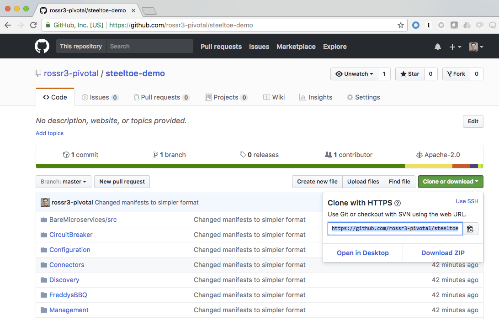
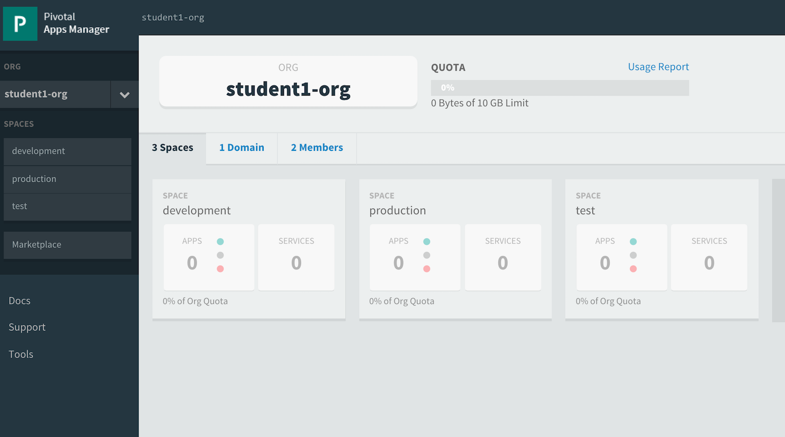
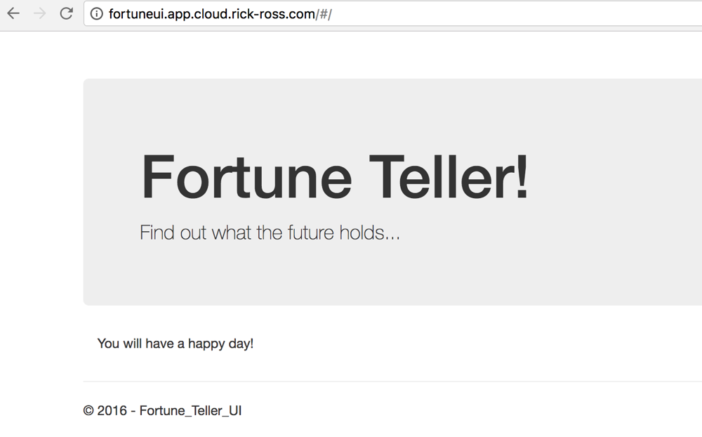
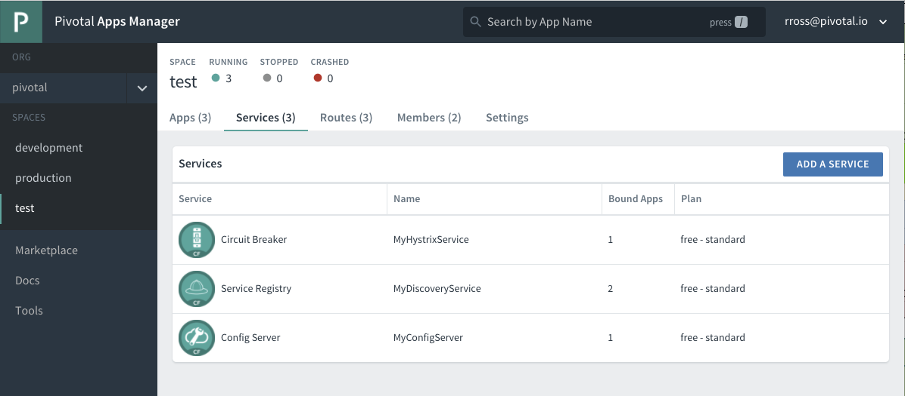
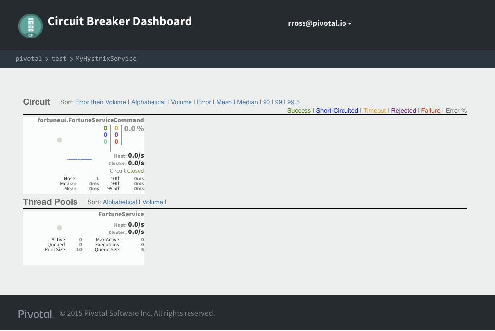
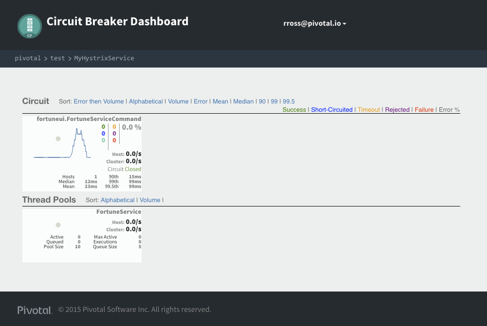

### Goal

Demonstrate how to use Steeltoe's Discovery and Circuit Breaker capabilities in a .NET Core application to retrieve configuration infomration from Spring Cloud Discovery and Circuit Breaker services. 

Prerequisites
--

1. Install .NET Core 2.0

    [.NET Core](https://www.microsoft.com/net/core)
    
    To validate the installation, run the following command from a command prompt or shell:

    ```bash
    dotnet  --version
    dotnet new console -o newapp
    cd newapp
    dotnet run
    ```    
    
    If successful, you should see a Hello World! in the output. 

2. Clone the Steeltoe Demo

	[Steeltoe Demo:  https://github.com/rossr3-pivotal/steeltoe-demo](https://github.com/rossr3-pivotal/steeltoe-demo)

	##### Get the source code for the demo app

    

	Fork and Clone

	[Steeltoe Demo:  https://github.com/rossr3-pivotal/steeltoe-demo](https://github.com/rossr3-pivotal/steeltoe-demo)

	For Linux/Mac:
	```bash
	$ git clone https://github.com/rossr3-pivotal/steeltoe-demo.git
	```

	For Windows
	```
	C:\<Some Directory to save code>\> git clone https://github.com/rossr3-pivotal/steeltoe-demo.git
	```
	
Steps
--

In this demmo we are going to follow these steps to deploy a couple of .NET Core applications that use the Service Discovery and the Circuit Breaker Dashboard to view the health of the microservices. 

***
## Deploying the Fortune Teller Service

### Step 1
##### Build the Fortune Teller Service

By this point, you should have cloned the [Steeltoe Demo:  https://github.com/rossr3-pivotal/steeltoe-demo](https://github.com/rossr3-pivotal/steeltoe-demo).  Let's prepare the application to deploy to Cloud Foundry. 

Change into the correct folder, which is CircuitBreaker/src/AspDotNetCore/FortuneTeller/Fortune-Teller-Service. Notice that we are going down several levels to the Fortune-Teller-Service Folder:

Linux/Mac:

```bash
cd CircuitBreaker/src/AspDotNetCore/FortuneTeller/Fortune-Teller-Service
```

Windows:

```
cd CircuitBreaker\src\AspDotNetCore\FortuneTeller/Fortune-Teller-Service
```
  
### Step 2
##### Login into Pivotal Cloud Foundry (if necessary)

```
cf login -a https://api.sys.cloud.rick-ross.com --skip-ssl-validation
Email: myuserid
Password: ••••••••

Select a space (or press enter to skip):
1. development
2. test
3. production

Select any one and stick to that space for the rest of the workshop.
```

Login to the App Console at https://app.cloud.rick-ross.com

   

### Step 3
##### Create a Config Server within Pivotal Cloud Foundry

Let's create a config server that the application will use to get configuration information from:

```
cf create-service p-service-registry standard MyDiscoveryService
```

Note that this step might take a bit to complete. Please wait until you see that the last operation resulted is "create succeeded". To do that:

```bash
cf services
Getting services in org pivotal / space development as admin...
OK
    
name                  service              plan       bound apps   last operation
MyDiscoveryService   p-service-registry   standard                create in progress
```
    
Once this is successful, you will see this:

```bash
cf services
Getting services in org pivotal / space development as admin...
OK
    
name                  service              plan       bound apps   last operation
MyDiscoveryService   p-service-registry   standard                create succeeded
```

You can now proced to the next step. 
    
### Step 4
#### Prepare the .NET Core application for deployment

```bash
dotnet restore --configfile nuget.config
dotnet publish -f netcoreapp2.0 -r ubuntu.14.04-x64
```

### Step 5
##### Push the app

Push the Fortune Service 

  On Linux/Mac:

```bash
$ cf push -f manifest.yml -p bin/Debug/netcoreapp2.0/ubuntu.14.04-x64/publish 
```
  
  On Windows: 
  
```bash
cf push -f manifest.yml -p bin\Debug\netcoreapp2.0\ubuntu.14.04-x64\publish
```

Which will result in output of

```bash
// This will give an output which is similar to this
requested state: started
instances: 1/1
usage: 1G x 1 instances
urls: fortuneservice.app.cloud.rick-ross.com
last uploaded: Sun Sep 3 23:58:01 UTC 2017
stack: cflinuxfs2
buildpack: ASP.NET Core (buildpack-1.0.25)
```

### Step 6
##### Look at the Logs for Steeltoe / Eureka events

Once the application is running, you'll notice Steeltoe and Eurkea logs coming through to show you that it has successfully registered with Eurkea.

Run the following command to view the activity:

```
cf logs fortuneservice --recent
```
   
The output should look similar to this:

```
   2017-09-03T19:58:38.68-0400 [APP/PROC/WEB/0] OUT dbug: Steeltoe.Discovery.Eureka.Transport.EurekaHttpClient[0]
   2017-09-03T19:58:38.68-0400 [APP/PROC/WEB/0] OUT       RegisterAsync https://eureka-0513a977-f47b-4862-aa30-75b51c3914d9.app.cloud.rick-ross.com/eureka/apps/FORTUNESERVICE, status: NoContent
   2017-09-03T19:58:38.68-0400 [APP/PROC/WEB/0] OUT dbug: Steeltoe.Discovery.Eureka.Transport.EurekaHttpClient[0]
   2017-09-03T19:58:38.68-0400 [APP/PROC/WEB/0] OUT       RegisterAsync https://eureka-0513a977-f47b-4862-aa30-75b51c3914d9.app.cloud.rick-ross.com/eureka/apps/FORTUNESERVICE, status: NoContent
   2017-09-03T19:58:38.68-0400 [APP/PROC/WEB/0] OUT dbug: Steeltoe.Discovery.Eureka.DiscoveryClient[0]
   2017-09-03T19:58:38.68-0400 [APP/PROC/WEB/0] OUT       Register FORTUNESERVICE/fortuneservice.app.cloud.rick-ross.com:c29738be-8cea-438d-78f2-db28 returned: NoContent
   2017-09-03T19:58:38.68-0400 [APP/PROC/WEB/0] OUT dbug: Steeltoe.Discovery.Eureka.DiscoveryClient[0]
   2017-09-03T19:58:38.68-0400 [APP/PROC/WEB/0] OUT       Register FORTUNESERVICE/fortuneservice.app.cloud.rick-ross.com:c29738be-8cea-438d-78f2-db28 returned: NoContent
   2017-09-03T19:58:39.12-0400 [APP/PROC/WEB/0] OUT info: Microsoft.EntityFrameworkCore.Storage.Internal.InMemoryDatabase[1]
   2017-09-03T19:58:39.12-0400 [APP/PROC/WEB/0] OUT       Saved 50 entities to in-memory store.
   2017-09-03T19:58:39.12-0400 [APP/PROC/WEB/0] OUT info: Microsoft.EntityFrameworkCore.Storage.Internal.InMemoryDatabase[1]
   2017-09-03T19:58:39.12-0400 [APP/PROC/WEB/0] OUT       Saved 50 entities to in-memory store.
   2017-09-03T19:58:39.16-0400 [APP/PROC/WEB/0] OUT dbug: Microsoft.AspNetCore.Hosting.Internal.WebHost[3]
   2017-09-03T19:58:39.16-0400 [APP/PROC/WEB/0] OUT       Hosting starting
   2017-09-03T19:58:39.25-0400 [APP/PROC/WEB/0] OUT dbug: Microsoft.AspNetCore.Hosting.Internal.WebHost[4]
   2017-09-03T19:58:39.25-0400 [APP/PROC/WEB/0] OUT       Hosting started
   2017-09-03T19:58:39.25-0400 [APP/PROC/WEB/0] OUT Hosting environment: Development
   2017-09-03T19:58:39.25-0400 [APP/PROC/WEB/0] OUT Content root path: /home/vcap/app
   2017-09-03T19:58:39.25-0400 [APP/PROC/WEB/0] OUT Now listening on: http://0.0.0.0:8080
   2017-09-03T19:58:39.25-0400 [APP/PROC/WEB/0] OUT Application started. Press Ctrl+C to shut down.
```

Periodically you will see logs that show the Discovery Server ensuring that the application is still available. It reaches out and is asking the Fortune Service application, are you still running? Do you want to Renew your registration with me? If the application instance is running it will respond back and Eureka will keep it in its internal list. 

```
   2017-09-03T19:59:08.86-0400 [APP/PROC/WEB/0] OUT dbug: Steeltoe.Discovery.Eureka.DiscoveryClient[0]
   2017-09-03T19:59:08.86-0400 [APP/PROC/WEB/0] OUT       Renew FORTUNESERVICE/fortuneservice.app.cloud.rick-ross.com:c29738be-8cea-438d-78f2-db28 returned: OK
```

## Deploying the Fortune Teller UI Application

### Step 1
##### Build the Fortune Teller UI Application

By this point, you should have cloned the [Steeltoe Demo:  https://github.com/rossr3-pivotal/steeltoe-demo](https://github.com/rossr3-pivotal/steeltoe-demo).  Let's prepare the application to deploy to Cloud Foundry. 

Change into the correct folder, which is CircuitBreaker/src/AspDotNetCore/FortuneTeller/Fortune-Teller-UI. Notice that we are going down several levels to the Fortune-Teller-UI Folder:

Linux/Mac:

```bash
cd ../Fortune-Teller-UI
```

Windows:

```
cd ../Fortune-Teller-UI
```

### Step 2
##### Create a Circuit Breaker Dashboard Service within Pivotal Cloud Foundry

Let's create a Circuit Breakder Dashboard for the application:

```
cf create-service p-circuit-breaker-dashboard standard MyHystrixService
```

Note that this step might take a bit to complete. Please wait until you see that the last operation resulted is "create succeeded". To do that:

```bash
cf services
Getting services in org pivotal / space development as admin...
OK
    
name                  service                       plan       bound apps       last operation
MyDiscoveryService   p-service-registry            standard   fortuneService   create succeeded
MyHystrixService     p-circuit-breaker-dashboard   standard                    create in progress
```
    
Once this is successful, you will see this:

```bash
cf services
Getting services in org pivotal / space development as admin...
OK
    
name                  service                       plan       bound apps       last operation
MyDiscoveryService   p-service-registry            standard   fortuneService   create succeeded
MyHystrixService     p-circuit-breaker-dashboard   standard                    create succeeded
```

You can now proced to the next step. 
    
### Step 4
#### Prepare the .NET Core application for deployment

```bash
dotnet restore --configfile nuget.config
dotnet publish -f netcoreapp2.0 -r ubuntu.14.04-x64
```

### Step 5
##### Push the app

Push the Fortune Teller UI

On Linux/Mac:

```bash
$ cf push -f manifest.yml -p bin/Debug/netcoreapp2.0/ubuntu.14.04-x64/publish 
```
  
 On Windows: 
  
```bash
cf push -f manifest.yml -p bin\Debug\netcoreapp2.0\ubuntu.14.04-x64\publish
```

Which will result in output of

```
// This will give an output which is similar to this
requested state: started
instances: 1/1
usage: 1G x 1 instances
urls: fortuneui.app.cloud.rick-ross.com
last uploaded: Mon Sep 4 00:21:40 UTC 2017
stack: cflinuxfs2
buildpack: ASP.NET Core (buildpack-1.0.25)
```

### Step 6
##### Look at the Logs

Once the application is running, you'll notice Steeltoe and Hystrix logs coming through to show you that it has successfully registered with Hystrix.

Run the following command to view the activity:

```
cf logs fortuneui --recent
```
   
The output should look similar to this:

```
   2017-09-03T20:22:06.59-0400 [CELL/0] OUT Successfully created container
   2017-09-03T20:22:08.01-0400 [CELL/0] OUT Starting health monitoring of container
   2017-09-03T20:22:09.79-0400 [APP/PROC/WEB/0] OUT info: Steeltoe.CircuitBreaker.Hystrix.MetricsStream.HystrixMetricsStreamPublisher[0]
   2017-09-03T20:22:09.79-0400 [APP/PROC/WEB/0] OUT       Hystrix Metrics starting
   2017-09-03T20:22:09.93-0400 [APP/PROC/WEB/0] OUT Hosting environment: Production
   2017-09-03T20:22:09.93-0400 [APP/PROC/WEB/0] OUT Content root path: /home/vcap/app
   2017-09-03T20:22:09.93-0400 [APP/PROC/WEB/0] OUT Now listening on: http://0.0.0.0:8080
   2017-09-03T20:22:09.93-0400 [APP/PROC/WEB/0] OUT Application started. Press Ctrl+C to shut down.
   2017-09-03T20:22:10.08-0400 [CELL/0] OUT Container became healthy
   2017-09-03T20:22:10.45-0400 [APP/PROC/WEB/0] OUT info: Steeltoe.CircuitBreaker.Hystrix.MetricsStream.HystrixMetricsStreamPublisher[0]
   2017-09-03T20:22:10.45-0400 [APP/PROC/WEB/0] OUT       Hystrix Metrics connected!
```

### Step 7
##### Visit the Fortune UI application in a Browser

Open the application URL in a browser. You will see something similar to this:

  

You can also tack on multiple at the end of the URL to have it return three Fortunes at once. In my case the full url would be this: [https://fortuneui.app.cloud.rick-ross.com/#/multiple](https://fortuneui.app.cloud.rick-ross.com/#/multiple)

### Step 8
##### Interact with the Hystrix Dashboard in Pivotal Cloud Foundry

Navigate to your apps manager, navigate to your org and space where your Fortune UI application is running. Click on the Services tab to see the services running:

  

Click on the Circuit Breaker service and then the Manage link in the upper right. If you are prompted to log in, do so. 

  

The dashboard gives you insights into what is going on with the microservices that your application is calling. Go back to the Fortune UI application in the browser and hit it several times using the multiple option. We want to get the traffic up to be able to see additional details in the dashboard.

  

Notice how you can see how many Hosts (Application Instances), the mean and median times and whether the circuit is closed (healthy) or not. Try going back and forth several times to see what times you are getting with your services.

For additional information on Steeltoe Service Discovery please see the official documentation.  
[http://steeltoe.io/docs/steeltoe-discovery/](http://steeltoe.io/docs/steeltoe-discovery/)

For additional information on Steeltoe Circuit Breaker, please see the official documentation.
[http://steeltoe.io/docs/steeltoe-circuitbreaker/](http://steeltoe.io/docs/steeltoe-circuitbreaker/)


